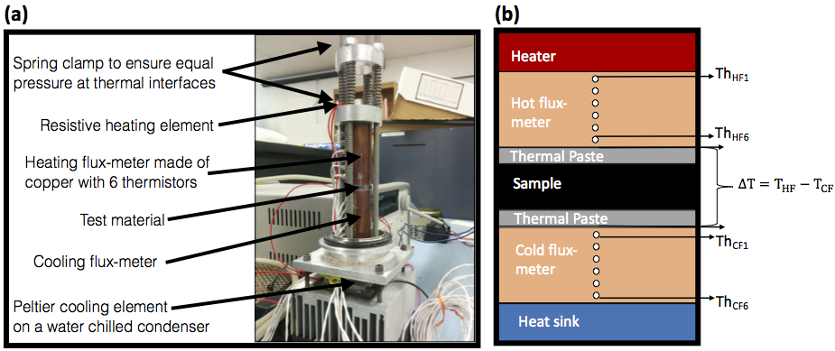
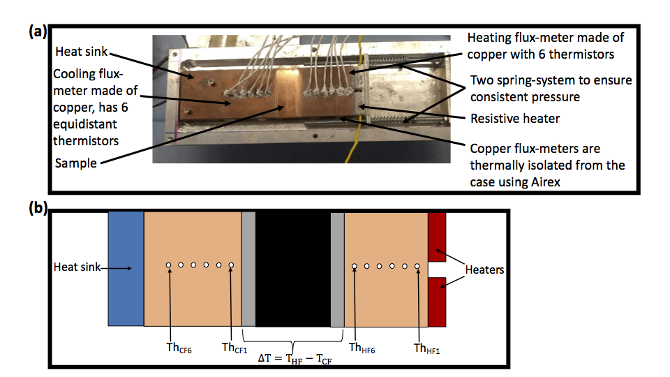

<html>

<body>

<h1> Thermal Conductivity Measurements of Carbon Fiber Composites and Thermal Interface Materials </h1>
<h2> Experiments conducted at Purdue University for the CMS Phase II Inner Tracker </h2>

 Purdue University hosts two home-made instruments for thermal conductivity measurements in steady-state conditions. One measures thermal conductivity through the plane of the material and the other measures conductivity in the plane of the material. This was done to disentangle kxx, kyy and kzz for anisotropic materials like carbon fiber. This repository contains C++ programs that compile into standalone executables for quick data analysis. The CERN ROOT library is used to make plots and fits.

<h3> Through-plane Conductivity Apparatus </h3>
<figure>
 
 <figcaption>(a) Image of the Purdue apparatus used to measure through-plane thermal conductivity. (b) Schematic for the through-plane apparatus depicting all major components. It shows 12 thermistors that are used to estimate the heat flux through the sample and the temperature across the sample.</figcaption>
</figure>
  

 The through-plane conductivity apparatus shown in Fig. 1 has been used to measure thermal conductivities of carbon fiber, thermal greases and thermal adhesives. A typical measurement requires 4 or more samples of the material to eliminate the interface resistance between the flux-meters and the samples. For carbon fiber, each sample has to be a cylindrical disc of 1" diameter. The samples are required to be of maximally varying thicknesses, from 1 mm to 3 mm. For thermal interface materials, such as greases and adhesives, they are applied between 1" diameter sapphire discs to achieve very precise thicknesses between 70 and 200 um. 

<h3> In-plane Conductivity Apparatus </h3>
<figure>
  
  <figcaption>(a) Image of the Purdue apparatus used to measure in-plane thermal conductivity. (b) Schematic for the through-plane apparatus depicting all major components. It shows 12 thermistors that are used to estimate the heat flux through the sample and the temperature across the sample.</figcaption>
</figure>
 

 The in-plane conductivity apparatus shown in Fig. 2 has been used to measure thermal conductivities of carbon fiber. A typical measurement requires 4 or more samples of the material. If we define length to be the direction in which we measure thermal conductivity, we need samples of width = 50.0 mm, thickness = 4.0 mm. For carbon fiber samples where we know thermal conductivity along the length will be O(100) W/mK, we recommend sample lengths in the range from 15 to 60 mm. For samples where we know it will be O(10) W/mK, we recommend sample lengths in the range from 5 to 20 mm. If samples are to be shipped to Purdue, it is of paramount importance to protect the edges from chipping.

</body>
</html>
